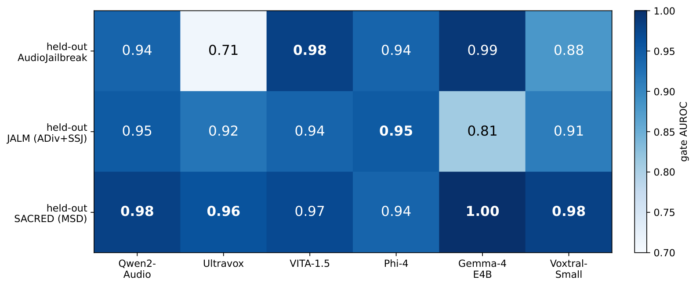
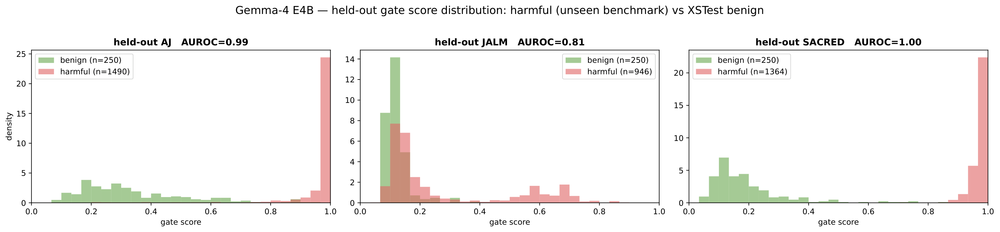
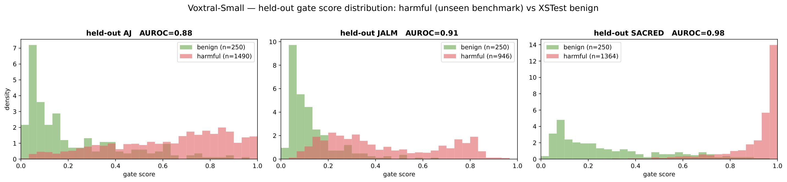
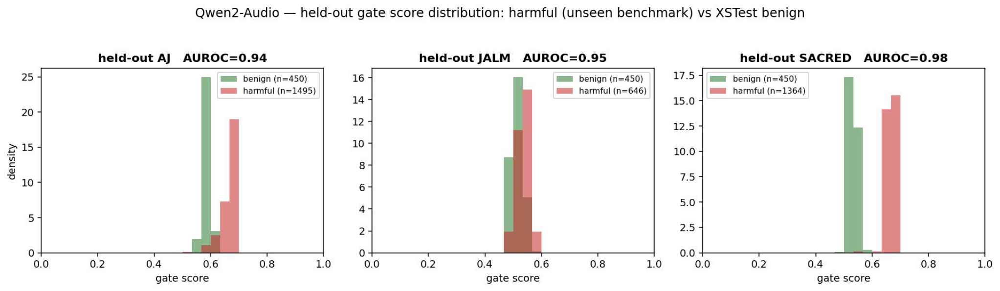
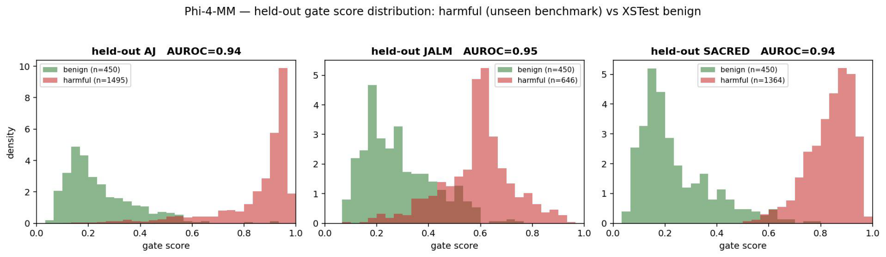
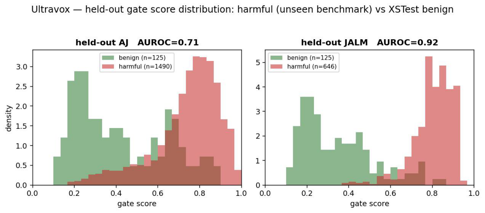
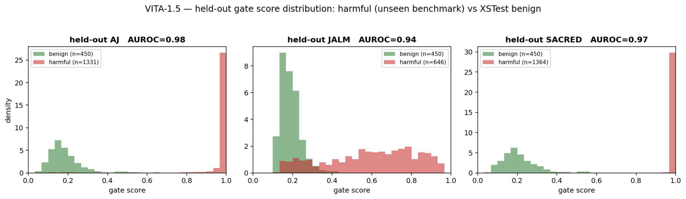

# Gate behaviour

What the risk gate separates before any threshold is applied. All scores here are the
raw sigmoid outputs written by `run_defense.py --score-only`, so nothing depends on
the operating point chosen later.

## Held-out detection



Gate AUROC with attacks as positives and XSTest benign as negatives, under LOBO
training, where the benchmark was never seen:

| Model | AudioJailbreak | SACRED | JALM |
|---|---:|---:|---:|
| Gemma-4 E4B | 0.99 | 1.00 | 0.81 |
| Phi-4 | 0.94 | 0.94 | 0.95 |
| VITA-1.5 | 0.98 | 0.97 | 0.94 |
| Qwen2-Audio | 0.94 | 0.98 | 0.95 |
| Ultravox v0.5 | 0.71 | 0.96 | 0.92 |
| Voxtral Small | 0.88 | 0.98 | 0.91 |

Detection transfers to an unseen attack family in 15 of 18 settings (AUROC ≥ 0.90).
The exceptions are Ultravox and Voxtral on held-out AudioJailbreak and Gemma-4 on
held-out JALM. Training in-domain removes them: on the same two models we can
recompute, in-domain AUROC is 0.99 / 1.00 / 1.00 (Gemma-4) and 0.97 / 1.00 / 1.00
(Voxtral).

Detection is not the bottleneck where residual unsafe rates remain. Phi-4 keeps a
0.95 AUROC on held-out JALM and still answers 7.6% of it; the gate fires and the
late-layer intervention fails to convert that into a refusal.

## Score distributions

One panel per benchmark: attack scores against XSTest benign, with the AUROC of that
panel in its title.

| | |
|---|---|
|  |  |
|  |  |
|  |  |

The supervised gate is calibrated, not merely ordered: benign mass sits near 0 and
attack mass near 1, which is why a single scalar threshold picked on XSTest transfers.
The label-free variant (`--gate-bce 0`) keeps a usable AUROC but collapses both modes
toward 0.5, and a hard threshold on it is fragile.

## Reproduce

```bash
# distributions, from the scores written during a run
python scripts/analysis/plot_gate_scores.py --models gemma4_e4b_it --protocol lobo

# AUROC per benchmark is part of the run summary
python scripts/summarize.py --run-dir runs/gemma4_e4b_it --protocol lobo \
    --response-key gemma4_response
python scripts/plot_gate_auroc.py --out assets/figures/gate_auroc \
    --summary "Gemma 4 E4B=runs/gemma4_e4b_it/lobo/summary.json"
```
