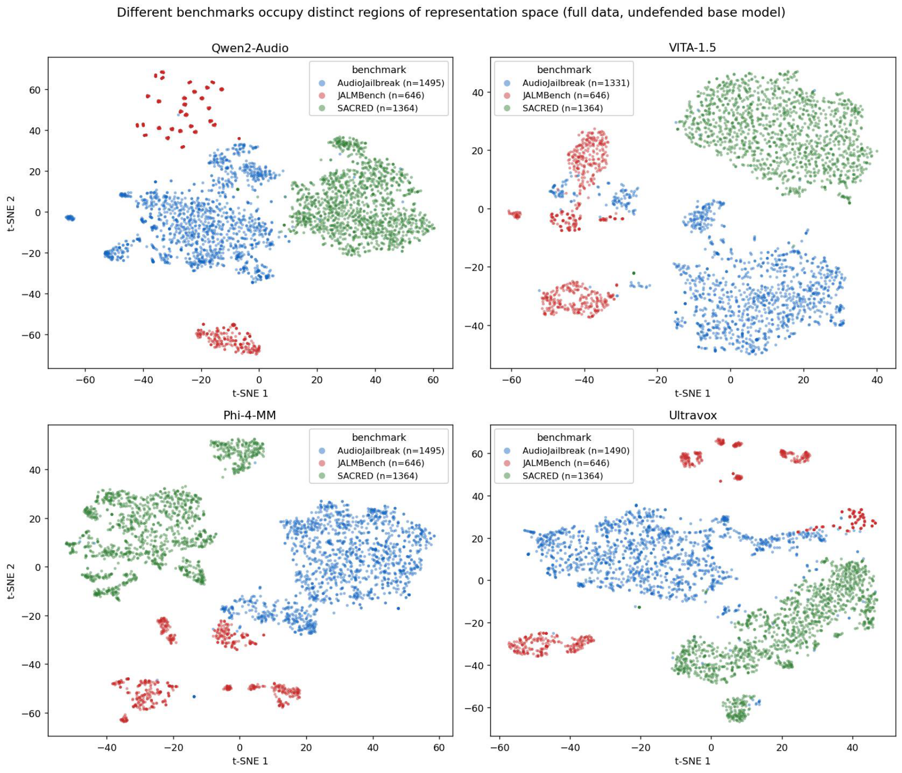
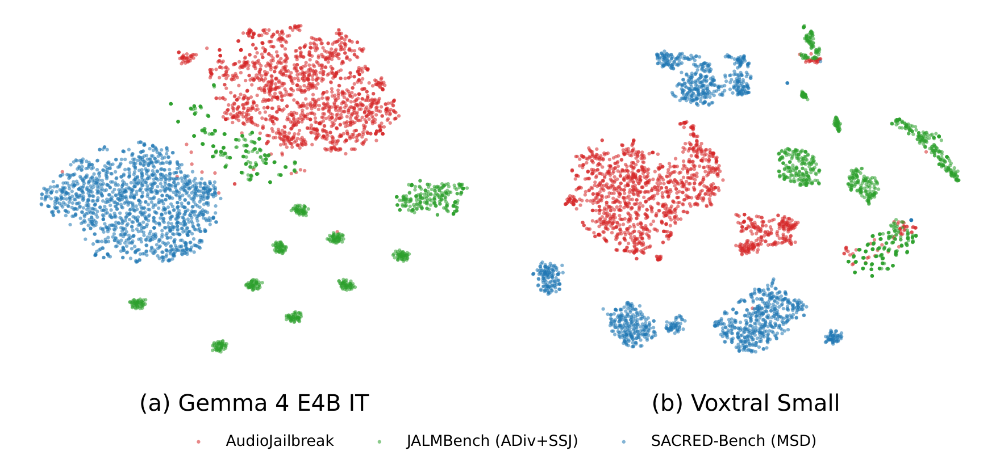
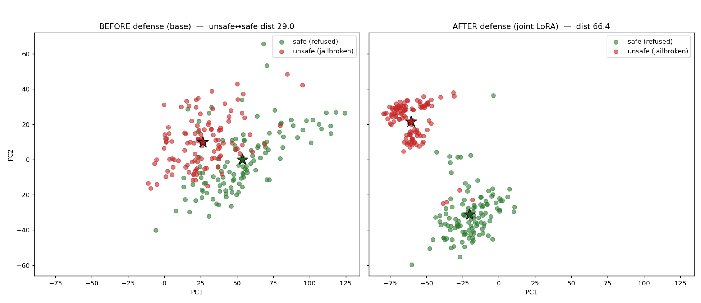
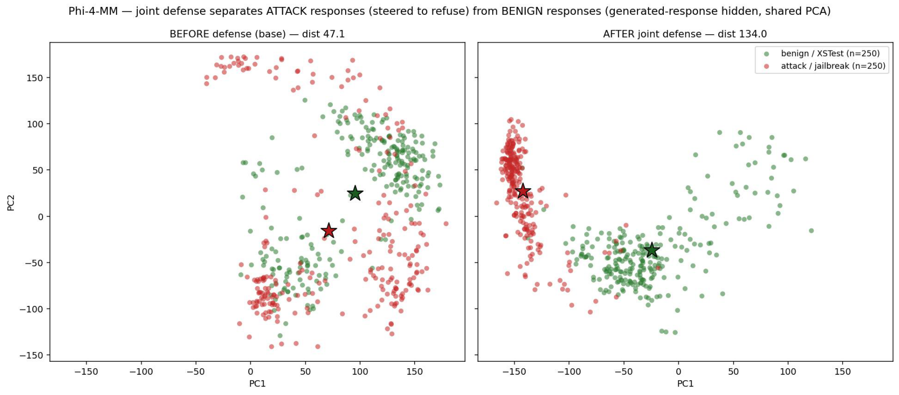
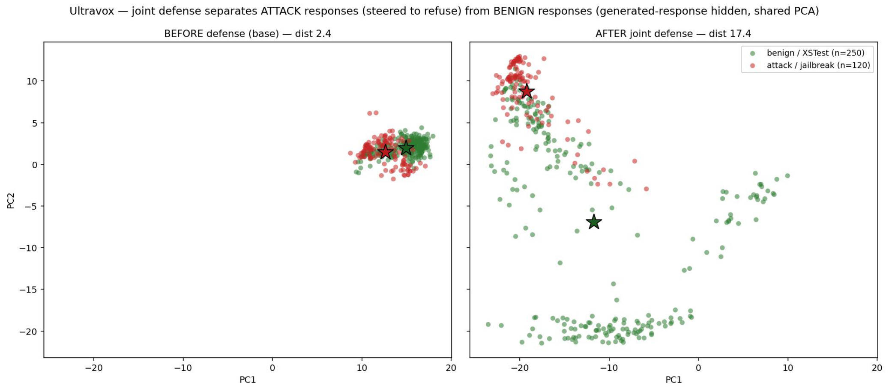
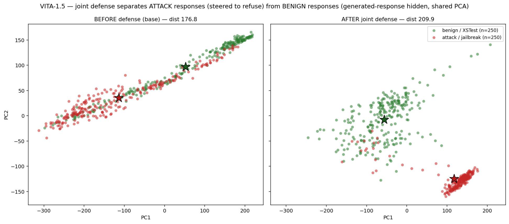
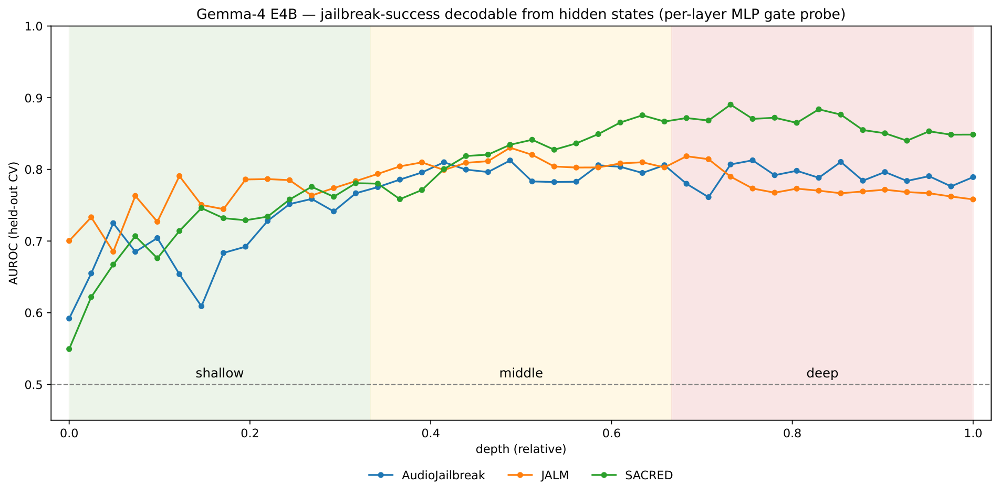
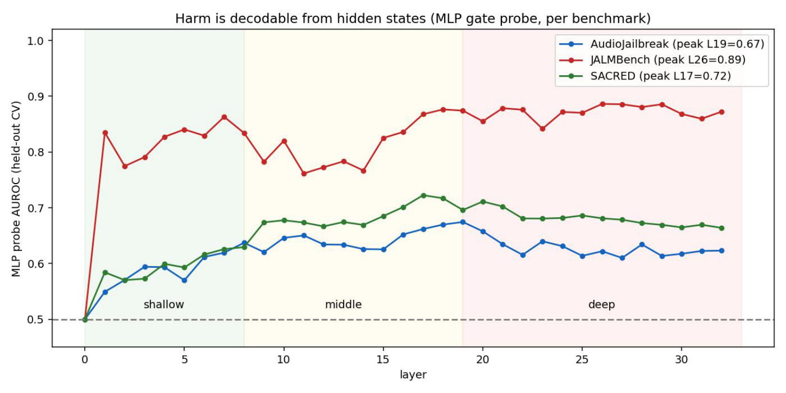
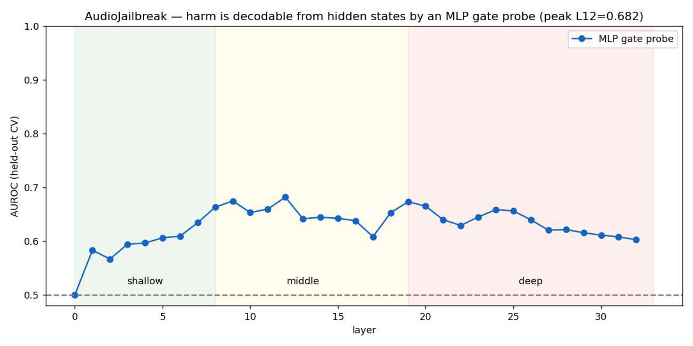

# Representations

Where attacks and benign inputs sit inside the frozen model, and what the defense
moves. Everything here reads the NPZ that `aegis/extract_hidden.py` writes, so it can
be redone for any registered model.

## Attacks are not one cluster



Hidden states coloured by benchmark. The three attack families occupy different
regions: they are different input distributions, not variations of one attack. This is
the reason the paper holds a whole family out rather than splitting one benchmark, and
the reason a defense fitted to one family need not transfer.



The same picture at the audio projector output, before the decoder: part of the
separation is already present in what the audio tower hands to the language model.

## What the defense moves



Attack and benign points in the top principal components of a late-layer hidden state,
before and after the intervention. Attack points move; benign points stay where they
were, which is the gate doing its job — with a low score the residual update is
multiplied by roughly zero.

| | | |
|---|---|---|
|  |  |  |

## Layer-wise separability



Per layer, an MLP probe on the last-input-token hidden state predicts the Llama-Guard
label of the response, scored by 5-fold CV AUROC, one line per benchmark. Separability
is low in the shallow layers, rises through the middle, and does not peak at the last
layer — which is what puts the gate in the middle and the intervention late.

| | |
|---|---|
|  |  |

## Reproduce

```bash
# 1. hidden states for a judged response set
python aegis/extract_hidden.py --model gemma4_e4b_it --device cuda:0 \
    --responses runs/gemma4_e4b_it/baseline/audiojailbreak_judged.jsonl \
    --out-npz feats.npz --out-meta feats_meta.jsonl

# 2. PCA / t-SNE coloured by benchmark and by attack-vs-benign
python aegis/analysis/tsne_pca.py --layer 21 --out-dir out/viz \
    --bench AJ:feats.npz:feats_meta.jsonl

# 3. per-layer transfer between benchmarks, plus the unsafe-direction cosine
python aegis/analysis/cross_benchmark.py --out-dir out/xb \
    --bench AJ:aj.npz:aj_meta.jsonl --bench JALM:jalm.npz:jalm_meta.jsonl
```
