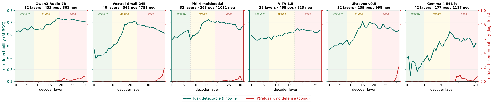

# The risk-to-refusal gap, six models

The paper shows this gap for one model. The same pipeline was run for all six.



Per layer, two quantities are measured on the **undefended** model, over the same
pooled attack rows:

- **Knowing** — how well a linear probe separates attacks the model answered
  (unsafe) from attacks it refused (safe), as 5-fold cross-validated AUROC on the
  last-prompt-token hidden state.
- **Doing** — the logit-lens refusal-token probability: the hidden state of that
  layer is pushed through the final norm and the LM head, and the probability mass
  on refusal-opening tokens is summed, then averaged over the jailbroken rows.

| Model | Layers | Unsafe / refused rows | Knowing L0 → max | Doing min → max |
|---|---:|---:|---|---|
| Qwen2-Audio-7B | 32 | 433 / 861 | 0.620 → **0.733** @L19 | 0.001 → 0.078 |
| Voxtral-Small-24B | 40 | 542 / 752 | 0.478 → **0.711** @L23 | 0.000 → 0.186 |
| Phi-4-multimodal | 32 | 263 / 1031 | 0.557 → **0.723** @L16 | 0.000 → 0.076 |
| VITA-1.5 | 28 | 468 / 823 | 0.592 → **0.648** @L18 | 0.000 → 0.003 |
| Ultravox v0.5 | 32 | 239 / 998 | 0.468 → **0.706** @L15 | 0.000 → 0.216 |
| Gemma-4 E4B-it | 42 | 177 / 1117 | 0.401 → **0.620** @L25 | 0.000 → 0.091 |

In every model the knowing curve rises into the middle layers while the refusal
probability stays near zero until the very end, if it rises at all. The outcome is
already partly decodable from the representation at a depth where the model is not
yet heading for a refusal, which is what AEGIS reads with its mid-layer gate.

## Choices that matter

- **The negatives are refused attacks, not benign audio** (`--negatives attack_safe`).
  Positives and negatives are then the same audio from the same benchmarks, differing
  only in outcome, so a probe cannot separate them by recording provenance. Benign
  negatives are available (`--negatives benign`) and give higher numbers, but on this
  data they are inflated by that shortcut: two genuinely benign sets, Benign_train and
  XSTest, are themselves separable at mid-layer AUROC 0.97–0.98.
- **Multilingual refusal openers** (`--refusal-set multi`). JALMBench ADiv is over half
  non-English; with the English-only opener list a correct Chinese or Arabic refusal
  scores near zero and the doing curve reads as flat for the wrong reason.
- Rows are capped per benchmark, keeping every unsafe row and subsampling the safe
  ones, because the unsafe class is the scarce one in every model.

## Reproduce

Needs `runs/<model>/baseline/<bench>_judged.jsonl` from `scripts/run_baseline.sh`.

```bash
MODEL=gemma4_e4b_it PY=python DEVICE=cuda:0 bash scripts/analysis/run_gap.sh
```

That builds the manifests, extracts hidden states, computes both curves, and redraws
the figure. The curves used above are committed in
[`scripts/analysis/curves/`](../../scripts/analysis/curves), so the figure can be
redrawn without a GPU:

```bash
python scripts/analysis/gap_plot_models.py
```
