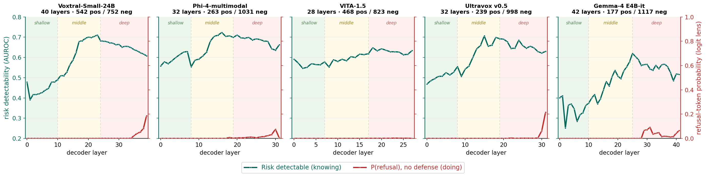

# The risk-to-refusal gap, the other five models

The paper shows this gap for Qwen2-Audio. It holds for the other five models as well.

Green traces how well a probe separates unsafe responses generated by the model from safe responses. Red traces the refusal-token probability read off from the same layer. Both are measured on the undefended model.

The pattern repeats across all five. Risk becomes more decodable through the shallow and
middle layers, peaking between layers 15 and 25 at an AUROC of 0.62 to 0.72, and then
flattens or drifts down in the deep layers. The refusal probability stays at zero through
all of it and only lifts in the final one or two layers, to 0.22 at most, and on VITA-1.5
not at all.

So the information is there, in the middle of the stack, while the model is still on its
way to answering. That is the gap AEGIS reads with its mid-layer gate.
