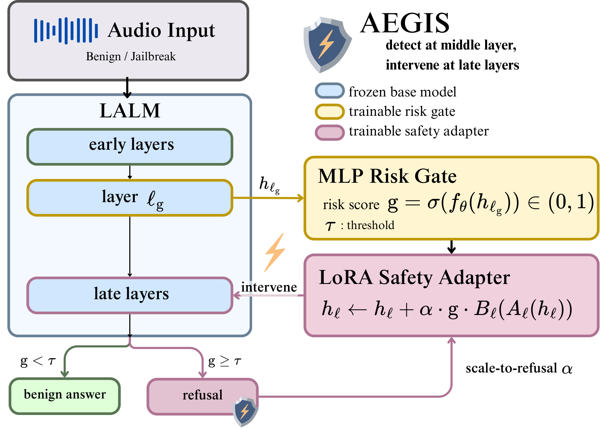

# Method

When an audio jailbreak succeeds against a large audio-language model (LALM), the model
has usually not missed the harmful intent. Layer-wise probing shows that harmfulness
stays decodable from intermediate representations, while refusal tendency in the later
layers stays weak — the *risk-to-refusal gap*. The same measurement for all six models is
in [the analyses](analysis/risk_to_refusal_gap.md).

AEGIS is a detect-then-intervene defense built on that observation. The base model stays
frozen, and two small modules are trained jointly:

- **Mid-layer risk gate.** An MLP (`D → 256 → 1`, sigmoid) reads the final prompt-token
  hidden state at a probe-selected middle layer `ℓ_g` and outputs a risk score `g`.
- **Late-layer safety adapters.** Rank-16 LoRA residual updates on the later layers,
  `h ← h + α · g · B(A(h))`, with `B` initialised to zero. Multiplying by `g` is what
  keeps benign inputs untouched.

The training loss is `L_LM + λ_BCE · BCE(g, z) + λ_L1 · g`, with `z = 1` for harmful and
`z = 0` for benign inputs, `λ_BCE = 1.0`, `λ_L1 = 0.01`. The language-modelling term is
computed on the target response only: harmful audio is teacher-forced to a generic
refusal, benign audio to the model's own answer.

At inference only inputs scoring above the threshold activate the adapters. For those,
`α` is raised over `{1.0, 1.5, 2.0, 2.5, 3.0}` until the first-token refusal probability
at the last layer reaches `τ = 0.5`; everything below the threshold runs the unmodified
model.

Layer choice, training data, threshold calibration and metrics are in the
[protocol section of the README](../README.md#protocol). The implementation is
`aegis/train_gate_lora.py` (training) and `aegis/run_defense.py` (inference).
